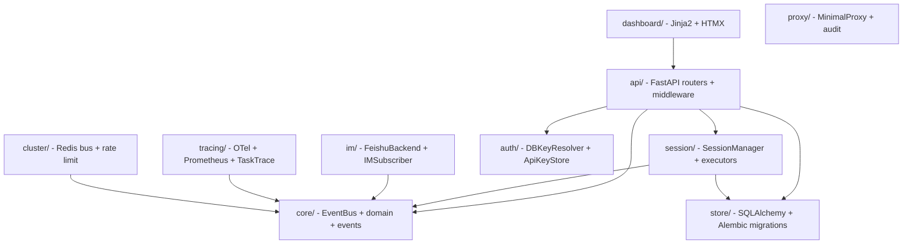

# gg-relay 仓库全景

## 项目定位

`gg-relay` 是一个 Python 中间件服务（v0.9.0），为团队协作使用 Claude Code SDK 提供完整的会话管理、事件驱动可观测性、IM 集成（飞书；其他后端可通过 `CardBuilder` Protocol 自行实现）和可视化仪表板。

## 技术栈

| 层 | 技术 |
|---|---|
| Web 框架 | FastAPI + Uvicorn |
| 持久层 | SQLAlchemy Core (async) + Alembic |
| 配置 | pydantic-settings (RELAY_* env) |
| 可观测性 | OpenTelemetry SDK + Prometheus |
| 模板 | Jinja2 + HTMX |
| SDK 集成 | claude-code-sdk >=0.0.14 |
| 可选依赖 | Redis (multi-worker), asyncpg (Postgres), kubernetes-asyncio (K8s executor) |

## 子系统拓扑



## 目录结构速览

```
src/gg_relay/
├── api/           # FastAPI app factory, routers, middleware (auth/rate-limit/audit)
├── auth/          # DB-backed API key resolver, env resolver, store
├── cli.py         # Typer CLI (serve, migrate, check-secrets, status, bootstrap-admin)
├── cluster/       # Multi-worker: Redis EventBus, Redis rate limiter, boot check
├── comments/      # Markdown → sanitized HTML (bleach)
├── config.py      # pydantic-settings Config (all RELAY_* env vars)
├── core/          # EventBus, domain enums, RelayEvent hierarchy, Protocol definitions
├── dashboard/     # Jinja2 templates + HTMX + static assets
├── im/            # IM protocol + Feishu backend + card builder + webhook router
├── maintenance/   # Retention job (data lifecycle)
├── proxy/         # Outbound HTTP proxy with audit logging
├── redaction/     # Secret redaction engine (regex + key-based)
├── session/       # SessionManager, executors (inprocess/docker/k8s), HITL, plugins, transport
├── store/         # SQLAlchemy schema, repository, migrations, durable events
├── subscribers/   # AlertRouter, FailureSubscriber, CostMetricSubscriber
└── tracing/       # OTel setup, MetricsSubscriber, TaskTraceSubscriber
```

## 核心设计原则

1. **EventBus 是唯一 fan-out 机制** — 生产者不直接耦合消费者
2. **所有插件接口使用 `typing.Protocol`** — 结构化类型，无导入耦合
3. **安全为 P0** — API key 认证、webhook 验签、日志脱敏从第一天开始
4. **不可变性** — frozen dataclass + immutable 容器贯穿全局
5. **`ClaudeSDKClient` 独占** — 从不使用 `query()` 快捷方式

## 快速导航

- [L1: gg-relay 系统架构与编码风格](L1-systems/gg-relay.md)
- [API 契约](api-contracts/gg-relay-api.md)
- [L3: Session Lifecycle 链路](L3-chains/session-lifecycle.md)
- [L3: HITL Decision Flow](L3-chains/hitl-decision-flow.md)
- [L3: EventBus Fan-out](L3-chains/eventbus-fanout.md)

## source_paths

- src/gg_relay/
- pyproject.toml
- docs/architecture.md
- CLAUDE.md
