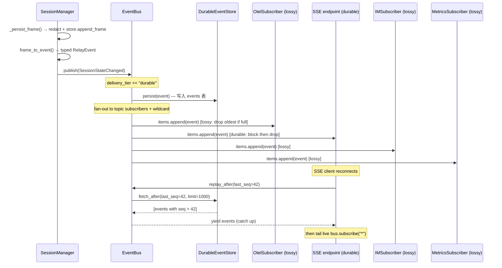

# L3 链路 — EventBus Fan-out

## 完整调用链



## Persist-Before-Fanout 保证

对 `delivery_tier="durable"` 事件：
1. **先写 DB**：`durable_store.persist(event)` — 生成 monotonic `seq`
2. **再 fan-out**：分发到 topic + wildcard 订阅者
3. **写失败即中止**：`DurableEventDropError` 向上传播，事件不分发

这保证：即使所有 subscriber 都 crash，durable 事件仍可从 DB replay。

## 背压机制

### Lossy tier (lossy)
```python
if len(sub.items) >= sub.maxsize:
    sub.items.popleft()  # 丢弃最旧
    sub.dropped += 1
    on_drop(topic)       # Prometheus counter
sub.items.append(event)
sub.waker.set()
```

### Durable tier
```python
if len(sub.items) >= sub.maxsize:
    sub.drained.clear()
    try:
        await asyncio.wait_for(sub.drained.wait(), timeout=1.0)
    except TimeoutError:
        sub.durable_dropped += 1  # 超时仍满 → 强制丢弃
    # Re-check post-await
    if still full: popleft() + dropped++
sub.items.append(event)
```

## SSE Last-Event-ID 重放

SSE 端点（`GET /api/v1/sessions/{id}/events`）解析 `Last-Event-ID: <seq>:<event_id>`：
1. 提取 `seq` → `bus.replay_after(last_seq=seq)`
2. Yield 历史 durable 事件（时间有序）
3. 无缝切到 `bus.subscribe("*")` tail live 事件
4. 只推送匹配 `session_id` 的事件

## 关键量化参数

| 参数 | 默认值 | 配置 |
|------|--------|------|
| per-subscriber queue size | 1000 | `subscribe(maxsize=...)` |
| durable block timeout | 1.0s | `EventBus(durable_block_timeout_s=...)` |
| replay limit | 1000 | `replay_after(limit=...)` |
| strict_durable | False | 生产 True → 无 store 时 publish 抛异常 |

## 已知风险

1. **Slow subscriber** — 单个慢消费者不会阻塞其他消费者（per-subscriber queue）
2. **Bus closed** — publish on closed bus 是 no-op（debug log）
3. **events 表膨胀** — `maintenance/retention.py` 提供 TTL 清理 job

## source_paths

- src/gg_relay/core/event_bus.py
- src/gg_relay/store/durable_event.py
- src/gg_relay/api/sse.py
- src/gg_relay/tracing/metrics_subscriber.py
- src/gg_relay/tracing/subscriber.py
- src/gg_relay/im/subscriber.py
