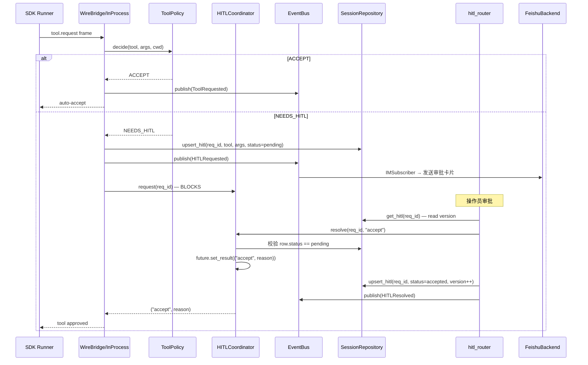

# L3 链路 — HITL Decision Flow

## 完整调用链



## 并发竞争防护

### 同 worker 竞争
- **HITLCoordinator** 内 `asyncio.Lock` 保护 `_pending` dict
- 第二个 `resolve()` 发现 `future.done()` → 抛 `HITLNotPending`

### 跨 worker 竞争
- **defence-in-depth**: coordinator 可选 `store` 引用
- `resolve()` 前先 `store.get_hitl(req_id)` 检查 row.status
- 非 pending → 抛 `HITLAlreadyResolved`（含 first_decision 信息）
- **DB 乐观锁**: `upsert_hitl(expected_version=...)` → `ConcurrencyError` → API 409

### 错误映射

| 异常 | HTTP | body.code |
|------|------|-----------|
| `HITLNotPending` | 409 | `hitl_already_resolved` |
| `HITLAlreadyResolved` | 409 | `hitl_already_resolved` (含 first_decision) |
| `ConcurrencyError` | 409 | `session_version_mismatch` |

## ToolPolicy 决策规则

```python
@dataclass(frozen=True, slots=True, kw_only=True)
class ToolPolicy:
    auto_accept_tools: frozenset[str]    # 文件类工具，路径校验后自动通过（Edit/Write/MultiEdit/NotebookEdit）
    hitl_tools: frozenset[str]           # 始终需 HITL（Bash/WebFetch/Task）
    neutral_tools: frozenset[str]        # 始终 ACCEPT（Read/Glob/Grep/LS）
    path_required_tools: frozenset[str]  # 路径缺失时 NEEDS_HITL
    dangerous_patterns: tuple[str, ...]  # 匹配则 NEEDS_HITL（*.env, */.git/*, etc）

    def decide(self, tool: str, args: dict[str, Any], cwd: Path) -> Decision
```

决策优先级:
1. `neutral_tools` → ACCEPT（无条件）
2. `auto_accept_tools` → 路径在 cwd 内且不匹配 dangerous_patterns → ACCEPT；路径越界/缺失/危险 → NEEDS_HITL
3. `hitl_tools` → NEEDS_HITL
4. 未知工具 → NEEDS_HITL（保守兜底）

## Feishu 卡片回调

```
Feishu callback → /api/v1/webhooks/feishu
  → verify HMAC
  → parse action (approve/reject)
  → coordinator.resolve(req_id, decision)
```

## 关键约束

- HITL 请求 **不重试** — 竞争者最多只有一个胜者，立即 409
- `cancel_all(session_id=sid)` — shutdown/cancel 时批量 deny 所有 pending 请求
- `pending_snapshot()` — dashboard 渲染当前待审批列表（shallow copy 防止外部修改）

## source_paths

- src/gg_relay/session/hitl/coordinator.py
- src/gg_relay/session/hitl/policy.py
- src/gg_relay/api/routers/hitl.py
- src/gg_relay/session/runner/bridge.py
- src/gg_relay/im/subscriber.py
- src/gg_relay/core/events.py
