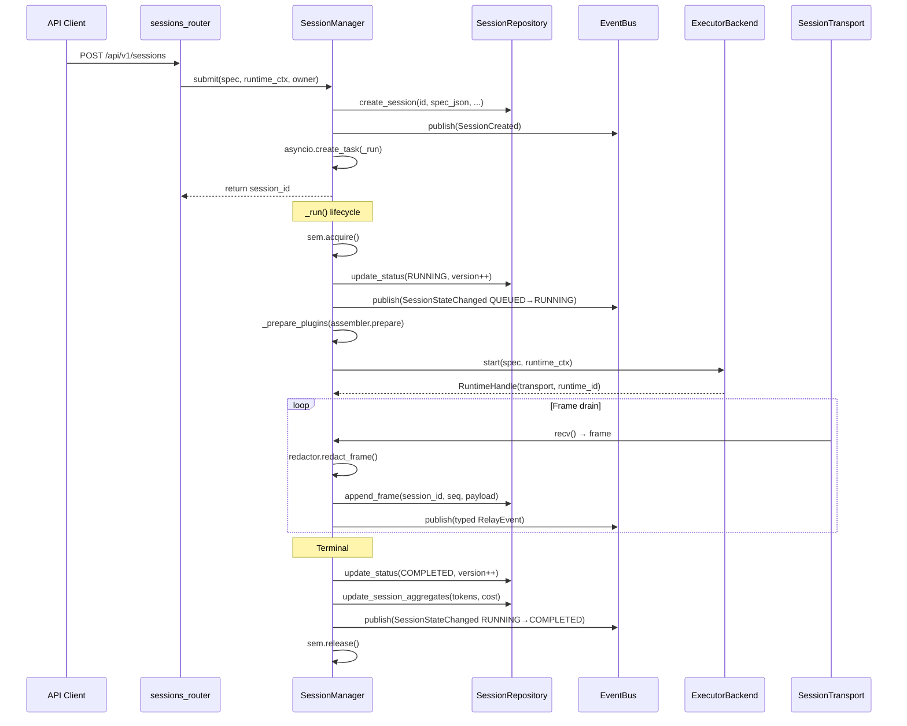

# L3 链路 — Session Lifecycle

## 完整调用链



## 关键量化参数

| 参数 | 默认值 | Config 字段 |
|------|--------|-------------|
| 最大并发 session | 10 | `max_concurrent` |
| Session 超时 | 1800s (30min) | `default_timeout_s` |
| Pause 超时 | 1800s | `paused_timeout_s` |
| 全局最大 paused | 50 | `max_paused` |
| Per-key 最大 paused | 20 | `max_paused_per_api_key` |
| Resume 信号量等待 | 60s | `resume_timeout_s` |
| 乐观锁 jitter 上限 | 50ms | `_RETRY_JITTER_MAX_S` |
| Shutdown grace | 30s | `grace_period_s` |

## Pause/Resume Slot 管理

```
pause():
  1. _check_paused_caps() — 校验全局 + per-key 上限
  2. read row.version (乐观锁锚点)
  3. bridge.pause(reason) → await ack (≤5s)
  4. _paused_set.add(sid)
  5. sem.release() — 让排队的 submit 继续
  6. _update_status_locked(PAUSED, version++)
  7. _arm_paused_timer(paused_timeout_s)

resume():
  1. sem.acquire(timeout=resume_timeout_s)
  2. bridge.resume(hint) → await ack
  3. _paused_holds_slot.discard(sid)
  4. _update_status_locked(RUNNING, version++)

_run() finally:
  if acquired_slot AND sid NOT in _paused_holds_slot:
    sem.release()  # 防止 double-release
```

## 异常恢复

**crash recovery** (`session/recovery.py`):
```python
await recover_on_startup(store)
# → store.mark_in_flight_as_interrupted()
# → SELECT WHERE status = 'running'
# → UPDATE SET status='interrupted', end_reason='interrupted_on_startup'
```

**paused timer recovery**:
```python
await recover_paused_timers(manager, store, paused_timeout_s=paused_timeout_s)
# → store.list_paused() — SELECT WHERE status='paused'
# → 计算 elapsed = now - paused_at
# → remaining > 0: manager._arm_paused_timer(sid, remaining_s=remaining)
# → remaining ≤ 0: manager.cancel(sid, reason='paused_timeout_recovered')
```

## 边界与风险

1. **乐观锁 race** — 两个 pause 请求同时到达，第二个在 jitter 重试后仍失败则 ConcurrencyError → API 409
2. **Resume timeout** — 信号量全满时 resume 等待 60s，超时 → ResumeQueueTimeout → API 429
3. **Double-release** — `_paused_holds_slot` set 追踪 slot 所有权防止 finally 中重复 release
4. **Shutdown during pause** — `paused_action='cancel'` 确保 paused session 被确定性 cancel

## source_paths

- src/gg_relay/session/manager.py
- src/gg_relay/core/domain.py
- src/gg_relay/session/recovery.py
- src/gg_relay/store/repository.py
- src/gg_relay/session/executor/protocol.py
- src/gg_relay/session/transport/protocol.py
